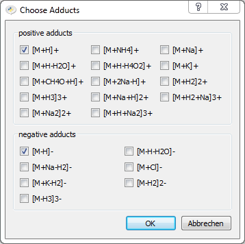

API helper modules
==================

Data of chemical Elements
-------------------------

.. automodule:: elements

.. pycon::
   :invisible:

   import elements
   import mass
   import abundance
   import adducts

Data of chemical elements are available from the *elements* module, e.g:

.. pycon::

   print elements.C
   print elements.C["m0"]
   print elements.C12
   print elements.C12["abundance"]

.. automodule:: mass

Masses and Masscalculation
--------------------------

Masses can be queried like this:

.. pycon::
 
   print mass.C13
   print mass.of("C4H8O2")

Nested formulas are supported:

.. pycon::

   print mass.of("C(CH2)4COOH")

And isotopes can be specified in brackets:

.. pycon::

   print mass.of("[13]C4H8O2")
   print mass.of("[13]CC2H8O2")

Natural Abundances of isotopes
------------------------------

.. automodule:: abundance

.. pycon::

   print abundance.C
   print abundance.C[12]
   print abundance.C12

Data of common Adducts
----------------------

.. automodule:: adducts

The *adducts* module provides information about most common ESI adducts,
adduct lists can be converted to a *Table* eg:

.. pycon::

    print adducts.labels
    subgroup = adducts.get("[M+H]+", "[M+Na]+")
    subgroup.toTable().print_()

    print adducts.namedLabels
    print adducts.M_plus_H
    print adducts.M_plus_Na_minus_H2

The following preselected groups of adducts exist:

.. pycon::

    print len(adducts.all)
    print len(adducts.positive)
    print len(adducts.negative)
    print len(adducts.single_charged)
    print len(adducts.double_charged)
    print len(adducts.triple_charged)
    print len(adducts.positive_single_charged)
    print len(adducts.positive_double_charged)
    print len(adducts.positive_triple_charged)
    print len(adducts.negative_single_charged)
    print len(adducts.negative_double_charged)
    print len(adducts.negative_triple_charged)

Further a default dialog can be opened for asking a multiple choice
selection of all adducts or of a subgroup:

.. pycon::

    tab = adducts.all.buildTableFromUserDialog() !noexec
    tab.print_() !noexec
    adduct_name mass_shift z       !asoutput
    str         float      int     !asoutput
    ------      ------     ------  !asoutput
    [M+H]+      1.007276   +1      !asoutput
    [M+2Na-H]+  44.971165  +1      !asoutput
    [M-H]-      -1.007276  -1      !asoutput
    [M-H-H2O]-  -19.017842 -1      !asoutput

