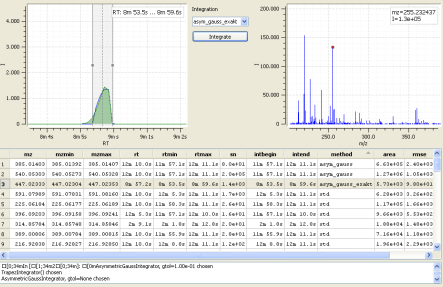

.. eMZed documentation master file, created by
   sphinx-quickstart on Tue Jan 24 18:40:08 2012.
   You can adapt this file completely to your liking, but it should at least
   contain the root `toctree` directive.

Welcome to emzed
----------------

Latest news
~~~~~~~~~~~

 * \  21. May 2013: released *eMZed* 1.3.8 with simplified installation of
   emzed 64 bit on windows, update to current pyopenms and bugfixes 

Website Navigation
~~~~~~~~~~~~~~~~~~

.. toctree::
   :maxdepth: 1

   installation
   getting_started
   tour
   explorers
   faq
   license
   contact

   references

About
~~~~~

.. image:: OSI-Approved-License-50x52.png
   :scale: 50 %
   :align: right

*eMZed* is an open source framework for analyzing and processing LCMS
data. The framework was developed by D-BIOL (Patrick Kiefer, lab of
Julia Vorholt, Institute of Microbiology, ETH Zurich) and Uwe Schmitt (mineway
GmbH, Germany) with several ideas in mind:

* Current frameworks and software are located on one of the following extremes: 

 * Fast and flexible frameworks, but in languages as C++ which only
   can be used efficiently by experienced programmers. Further playing with new
   ideas for analyzing data is hard due to the programming
   effort and slow edit-compile cycles.  

 * Closed black box solutions with graphical user interfaces. These
   are easy to use, but not flexible at all.

Our goal was to combine the positive aspects of both extremes: an easy
to learn framework which is flexible and allows inspection and analysis
of data either interactive or by easy to write Python scripts. This is
one of the reasons why we choose Python.

* The invention of workspace providing software as Matlab and R
  leveraged the productivity of mathematicians and other scientists. We
  try to introduce this concept for analyzing LCMS data.

  *eMZed* is based on Spyder [spyderlib]_ for providing
  the workspace and [guiqwt]_ and [guidata]_ for plotting.

* Instead of reinventing the wheel we cherry picked algorithms from
  other frameworks and libraries. In the current version we use
  algorithms from Open-MS [openms]_ and XCMS [xcms]_.

* In order to avoid imports and exports to other software, we try to
  integrate all needed functionality in one framework.

The current version of *eMZed* was developed and tested on 32 bit Windows OS.
We partially tested on 64 bit Ubuntu 12.04, a 64 bit version for Windows OS
is in progress.

Credits
~~~~~~~

We make use of the following frameworks and we thank their developers for the
great work:

     * Open-MS [openms]_
     * XCMS [xcms]_
     * spyderlib [spyderlib]_
     * guidata and guiqwt [guidata]_, [guiqwt]_

Personal thanks go to:

     *  Department of Biology, ETH Zurich

     *  `Julia A Vorholt <http://www.micro.biol.ethz.ch/research/vorholt/jvorholt>`_

     *  `Jonas Grossmann <http://www.fgcz.ch/people/jgrossmann>`_

     *  `Peter Zoltan Kunszt <http://www.systemsx.ch/projects/systemsxch-projects/sybit/>`_

     *  `Lars Gustav Malström <http://www.imsb.ethz.ch/researchgroup/malars>`_
    
     *  Pierre Raybaut

Indexes and tables
~~~~~~~~~~~~~~~~~~

* :ref:`genindex`
* :ref:`modindex`
* :ref:`search`
