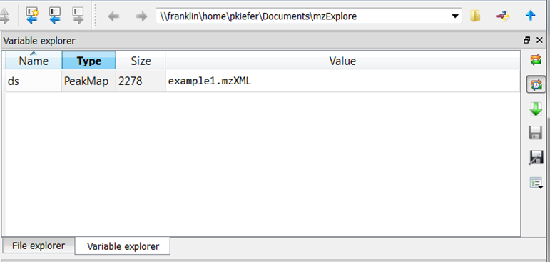
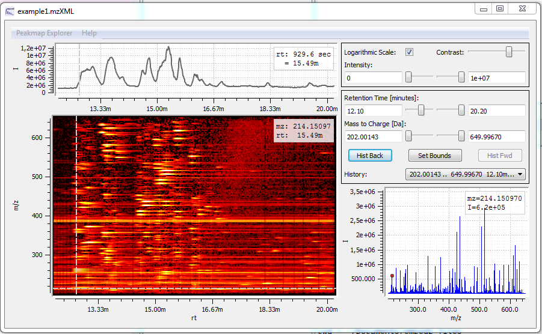
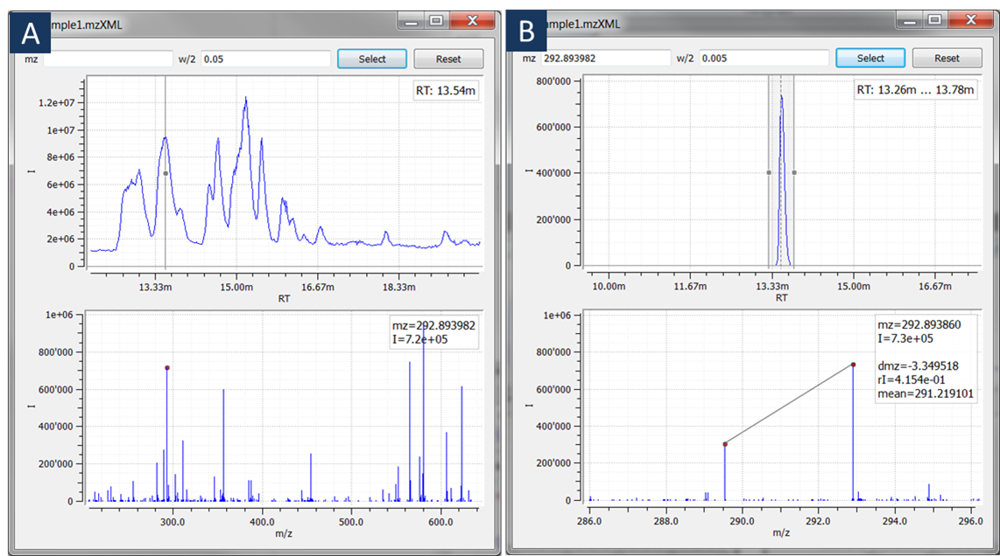
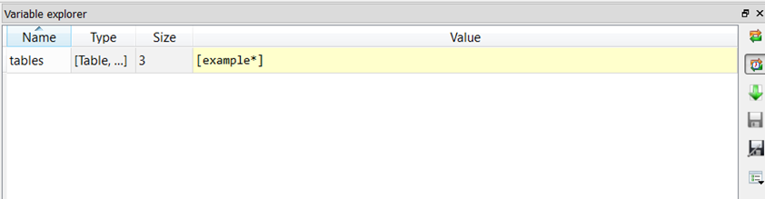
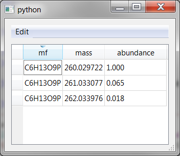
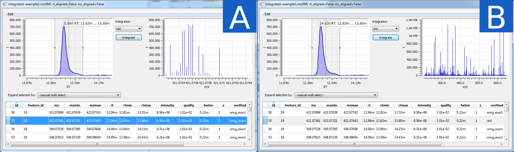
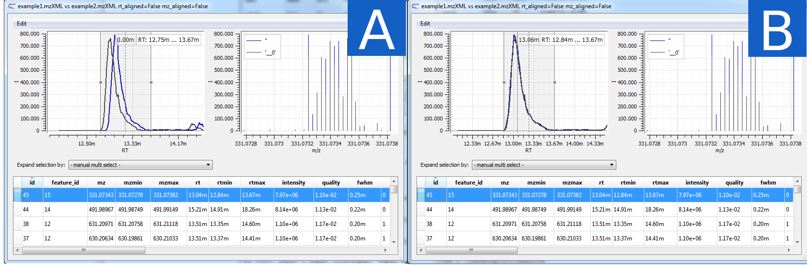
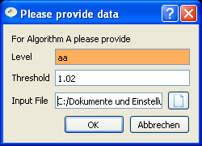

.. _getting_started_with_emzed_modules:

Getting started with emzed modules
==================================

This is a short tour which shall give you a first impression of working with *emzed*
modules. We suppose that you followed the instructions at
:ref:`installation` to get *emzed* installed and that you did the first
steps as described in :ref:`getting_started`.

As *Python* is a programming language with a very clear syntax, even a novice
Python programmer will very likely be able to grasp the examples below.
Indeed, Python is very easy to learn.  You find a comprehensive list of Python
tutorials at http://wiki.python.org/moin/BeginnersGuide

We mark the user input in the following examples with a leading ``>>>`` ,
as in the following code example:

.. pycon::
    import emzed
    print emzed.mass.C13

Before you try out the examples below change the working directory
to the folder ``emzed_files/example_scripts`` which you find in your personal
home directory.

.. _peakmaps_example:

Working with Peak Maps
----------------------

*emzed* allows loading, inspecting and basic filtering of
LC-MS(/MS) data files in different formats. To load your single data files to
the workspace use the command ``loadPeakMap``. If you are unsure how to use a
command, you can get some help as follows:

.. pycon::
   :invisible:

   ds = emzed.io.loadPeakMap("example1.mzXML")

.. pycon::
    help(emzed.io.loadPeakMap)

So if we call the function without giving a specific path, you will be asked to
choose a file. Please choose the file ``example1.mzXML`` from your current
folder:

.. pycon::
   ds = emzed.io.loadPeakMap() !noexec

You can access the spectra in this peak map using Python:

.. pycon::
   firstSpec = ds.spectra[0]
   print firstSpec.rt, firstSpec.msLevel, firstSpec.polarity
   lastSpec = ds.spectra[-1]
   print lastSpec.rt

Internally, retention times are always stored as seconds.

The variable ``ds`` will appear in the *variable explorer*. You see that we
have 2278 spectra in this dataset and you can visualize them simply by double
clicking on ``ds``.

Alternatively use the command

.. pycon::
   emzed.gui.inspect(pm) !noexec

The upper plot shows the TIC and the lower plot the ms spectrum indicated by
the bar with the center dot.

A. You can move the bar in the upper chromatogram plot with the mouse by clicking
   the bar.  *m/z* values and intensities of mass peaks in the chosen spectrum
   are depicted in the lower plot.

B. You can extract an ion chromatogram by entering data
   into the two input fields  for providing a
   central ``m/z`` value and a half window width ``w/2`` and then pressing
   ``Select``.  If you press the right button during moving the mouse the plots
   will zoom in or out.  Pressing the ``backspace`` key will reset the active
   plot.  Furthermore, you can measure peak relations by dragging the mouse in the
   lower plot.

.. _metaboff_example:

Extracting chromatographic peaks
---------------------------------

*emzed* includes three peak detection algorithms: *MetaboFeatureFinder* from
[openms]_ and two of the *XCMS* [xcms]_
package: *centwave* [centwave]_ and *matched filters*. Accepted input file
formats are *mzML*, *mzXML*, and *mzData*.  The output file format is
*emzed*-specific and has the file extension ``.table``.

We continue with an example of *MetaboFeatureFinder* algorithm for high resolution LC-MS
MS-1-data. Analysing MS-n for *n=2* data is possible too, please look at the
SRM/MRM example workflow mentioned at :ref:`faq`:

You can start the *MetaboFeatureFinder* feature detector by typing

.. pycon::
   tables = emzed.batches.runMetaboFeatureFinder("*.mzXML", destination=".", configid="std")!noexec

.. pycon::
   :invisible:

   tables = emzed.batches.runMetaboFeatureFinder("*.mzXML", destination=".", configid="std") !noexec
   for i, t in enumerate(tables): t.store("feat%d.table" % i) !noexec
   tables = [ emzed.io.loadTable("feat%d.table" % i) for i in range(3) ]

The feature detector needs a few minutes depending on the power of your
computer, we omitted the verbose output.  We predefined a
combination of parameters with the identifier ``tour`` in order to simplify the
instructions. In general various parameters can be provided individually. For
getting (a lot of) details use the *Python* help system

.. pycon::
   help(emzed.batches.runMetaboFeatureFinder) !noexec

The return value ``tables`` is a  list containing three tables,
you see them in the *variable explorer*.

Please open the table list by double clicking the variable ``tables`` in the
*variable explorer*.

A. Now you can select a specific table using the ``Choose Table`` menu at the
   top of the window. In each table parameters of detected peaks are depicted
   row wise. You can visualize corresponding *Extracted Ion Chromatograms*
   (*EIC*) and mass spectra by clicking to the left of a row. Table entries
   are editable (just double click to a certain cell) and all modifications are
   stored in place.  Notice that the original peak map is linked to the table
   and the underlying spectral data is accessible.

B. If you click with the right mouse button to the left of a row
   you see a context menu with commands for manipulating whole rows.
   All manipulations to the table can be undone using this context menu
   or the commands below the ``Edit`` menu at the top of the window.

.. _integration_example:

Integrating Peaks
-----------------

To reduce the runtime in the following demonstration we will extract peaks with
a quality above ``1e-2``:

.. pycon::
   tab1, tab2, tab3 = tables
   print len(tab1)
   tab1 = tab1.filter(tab1.quality > 1e-2)
   print len(tab1)
   tab2 = tab2.filter(tab2.quality > 1e-2)

Detected Peaks can be integrated. To perform peak integration columns *rtmin*,
*rtmax*, *mzmin*, and *mzmax* are mandatory. We use the *EMG* integrator:

.. pycon::
   tabInt = emzed.utils.integrate(tab1, 'emg_exact')

If you open the dialog for ``tabInt`` you can select a row, as is shown in Figure A.

A. For all integrated peaks *area* and *rmse* values are added automatically
   to the table. As *EMG* fits a function to the *EIC*, you see this function
   in the chromatogram plot.

B. You can manually reintegrate individual *EIC* peaks by adapting the *rt* bounds
   in the chromatogram plot, then choosing one of the provided integration
   methods and pressing ``Integrate``.
   The result will be plotted in the chromatogram plot and the corresponding
   row is updated.

.. _rtalign_example:

Aligning Features
-----------------

The retention time alignment is performed by the Pose Clustering
alignment algorithm [poseclustering]_ implemented in OpenMS [openms]_.

.. pycon::
   tablesAligned = emzed.align.rtAlign(tables, destination=".") !nooutput

In this simple use case all tables are aligned to the table with the most peaks.

To visualize the *rt* shift on tables we will now combine two tables before and
after alignment.
Users which are familiar to relational databases will recognize the
``JOIN`` statement from the ``SQL`` language. More information about
combining and filtering tables will be given below at :ref:`table_example`.

.. pycon::
   before = tab1.join(tab2, tab1.mz.approxEqual(tab2.mz, 3*emzed.MMU) & tab1.rt.approxEqual(tab2.rt, 30*emzed.SECONDS))

Open the window for table ``before`` and sort the table to ascending  ``sn`` values
and click on column with ``id`` 191.

Now repeat the same procedure for the same tables after retention time
alignment:

.. pycon::
   tabA1, tabA2, tabA3 = tablesAligned
   tabA1 = tabA1.filter(tabA1.quality>1e-2)
   tabA2 = tabA2.filter(tabA2.quality>1e-2)
   after = tabA1.join(tabA2, tabA1.mz.approxEqual(tabA2.mz, 3*emzed.MMU) & tabA1.rt.approxEqual(tabA2.rt, 30*emzed.SECONDS))

Open now the table ``after``, sort again and choose the same row as above.

The plot shows the overlay of two *EIC* peaks of the same compound in two
different samples before (A) and after (B) retention time alignment.

.. _table_example:

Working with Tables
-------------------

This section demonstrates some operations on tables, which are a central data
structure in *emzed*, you have already seen them above as peak tables.

An easy way to create tables is to parse a *csv* file. This is how the
content of ``example.csv`` looks like:

.. pycon::

    print open("example.csv").read()

We load this table and print some information about it:

.. pycon::

    substances = emzed.io.loadCSV("example.csv")
    substances.info()
    substances.print_()

That is the table has two columns named ``name`` and ``mf`` and both
contain data of type ``str``.

If the table is to complex or large for printing, you can open a dialog by
clicking to the ``substances`` entry in the *variable explorer*  or from the
command line:

.. pycon::

    emzed.gui.inspect(substances)  !noexec

Adding a new, computed column is easy. Here we want to generate a new column
``m0`` which contains the mono-isotopic masses corresponding to the contents of
the ``mf`` column. Converting a molecular formula to the corresponding
mono-isotopic weight can be done by the function ``emzed.mass.of``:

.. pycon::

    print emzed.mass.of("H2O")

Generating the new column ``m0`` is done by applying this function to
the column ``substances.mf``:

.. pycon::

    substances.addColumn("m0", substances.mf.apply(emzed.mass.of))
    substances.print_()

Now we want to add some extra information to ``substances``, this
information is stored in ``information.csv``:

.. pycon::
    print open("information.csv").read()
    info = emzed.io.loadCSV("information.csv")
    info.print_()

As you can see ``emzed.io.loadCSV`` recognized that the column ``info.onEarth`` only
contains integers.

To combine both tables we use an SQL-like ``LEFT JOIN`` to match rows with the
same molecular formula:

.. pycon::
   :invisible:

   joined = substances.leftJoin(info, substances.mf == info.mf)

.. pycon::

    joined = substances.leftJoin(info, substances.mf== info.mf) !noexec
    joined.print_()

To restrict to substances which are known to exist on earth we can do:

.. pycon::

    common = joined.filter(joined.onEarth__0 == 1)
    common.print_()

The ``emzed.db`` module contains some databases, e.g. the substances from PubChem
[pubchem]_ categorized as *metabolomic compounds*. These databases are hold in
tables:

.. pycon::

    pc = emzed.db.load_pubchem()
    pc.filter(pc.cid <= 3).print_()
    emzed.gui.inspect(pc)  !noexec

Before matching our data against the large *PubChem* table, we build an index
on this table in order to speed up the following ``leftJoin`` call.  Building
an index is done by sorting the corresponding column:

.. pycon::

    pc.sortBy("m0")
    matched = joined.leftJoin(pc, (joined.onEarth__0 == 1) & joined.m0.approxEqual(pc.m0, 15 * emzed.MMU))
    print matched.numRows()
    matched.print_()
    emzed.gui.inspect(matched)  !noexec

.. _chemistry_example:

Accessing Chemical Data
-----------------------

The ``mass`` module provides the masses of an electron, a proton or a neutron
and all all important elements

.. pycon::

    print emzed.mass.e # electron
    print emzed.mass.C, emzed.mass.C12, emzed.mass.C13

Additionally, it provides functions to calculate masses of molecules from their sum
formula

.. pycon::

    print emzed.mass.of("C6H2O6")

One can consider isotopes too:

.. pycon::

    print emzed.mass.of("[13]C")
    print emzed.mass.of("[13]C6H2O6")
    print emzed.mass.of("[13]C3[12]C3H2O6")

The ``elements`` module provides information of important elements

.. pycon::

    print emzed.elements.C
    print emzed.elements.C13

``abundance`` is a module which provides the natural abundances of common
elements

.. pycon::

    print emzed.abundance.C

.. _isotope_example:

Generating isotope patterns
---------------------------

As the ``Table`` objects provide powerful matchings, all we need to analyze
isotope patterns occurring in feature tables is a way to generate tables
containing these data. ``emzed.utils.isotopeDistributionTable`` does this

.. pycon::

    tab = emzed.utils.isotopeDistributionTable("C4S4", minp=0.01)
    tab.print_()

Non natural distributions as in marker experiments can be simulated too

.. pycon::

    iso = emzed.utils.isotopeDistributionTable("C4S4", C=dict(C12=0.5, C13=0.5))
    iso.replaceColumn("abundance", iso.abundance / iso.abundance.sum() * 100.0)
    iso.print_()

The method can simulate the resolution of the used mass analyzer

.. pycon::

    tab = emzed.utils.isotopeDistributionTable("C4S4", R=10000, minp=0.01)
    tab.print_()

Matching isotope patterns now works like this

.. pycon::

    iso = emzed.utils.isotopeDistributionTable("H2O", minp=1e-3)
    iso.addEnumeration()
    iso.print_()

.. pycon::

    common.dropColumns("mf__0", "onEarth__0")
    matched = iso.leftJoin(common, iso.mass.approxEqual(common.m0, 1*emzed.MMU))
    matched.print_()

.. _statistics_example:

Statistical Analysis
--------------------

The framework provides two methods for comparing two datasets by analysis of
variance: classical *one way ANOVA* and non parametric *Kruskal Wallis*
analysis.  These methods work on tables like this

.. pycon::

    group1 = [ 1.0, 0.9, 1.2, 1.4, 2.1]
    group2 = [ 1.0, 2.2, 2.3, 1.9, 2.8, 2.3]

    t = emzed.utils.toTable("measurement", group1 + group2)

    indices = [1]*len(group1) + [2] * len(group2)
    print indices

    t.addColumn("group", indices)
    t.print_()

``emzed.stats.oneWayAnova`` returns the corresponding ``F`` and ``p`` value,
``emzed.stats.kruskalWallis`` the ``H`` and ``p`` value

.. pycon::

    F, p = emzed.stats.oneWayAnova(t.group, t.measurement)
    print p

.. pycon::

    H, p = emzed.stats.kruskalWallis(t.group, t.measurement)
    print p

.. _dialogbuilder_example:

Quering METLIN web service
--------------------------

As the METLIN Rest interface is out ouf order at this juncture we removed the
former examples and leave this paragraph empty.

.. comment pycon::

    t = emzed.utils.toTable("m0",[195.0877, 194.07904])
    t.print_()
    matched = emzed.utils.matchMetlin(t, "m0", ["M"], ppm=30)
    matched.print_()

.. comment pycon::

    t = emzed.utils.toTable("m0",[194.07904])
    t.print_()
    matched = emzed.utils.matchMetlin(t, "m0", ["M+H", "M+2H"], ppm=30)
    matched.print_()

.. _dialogbuilder_example2:

Building graphical interfaces
-----------------------------

Beyond the ``Table``-Explorer ``emzed.gui.inspect`` and the ``PeakMap``-Explorer
``emzed.gui.inspect`` assisted work-flows request certain parameters and
decisions at certain processing steps. To support this *emzed* has an builder
for input forms.

The following dialog is created by the simple commands below:

.. pycon::

    b = emzed.gui.DialogBuilder(title="Please provide data")
    b.addInstruction("For Algorithm A please provide")
    b.addInt("Level")
    b.addFloat("Threshold")
    b.addFileOpen("Input File")
    print b.show()                            !noexec
    (10, 1.02, 'C:/Dokumente und Einstellungen/e001.mzML') !asoutput

.. comment 

    this is not up to date

    What's next ?
    -------------

    *emzed* installs example scripts in the ``emzed_files/example_scripts``
    folder in your home directory. We recommend to study these scripts to
    get an understanding how the inididual *emzed* modules play together.

